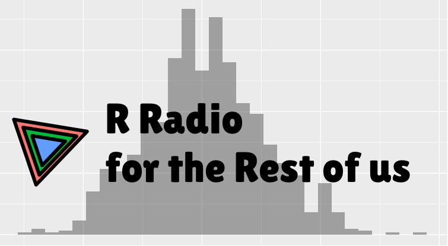

# R Radio for the Rest of us.

RユーザによるRユーザのためのラジオ。Rについてわいわい話します。

https://rlangradio.org

**ゲスト募集中**です！

## ラジオの更新の仕方
- このレポジトリを `git clone` します
- 収録したラジオをMP3形式にして `audio` ディレクトリ下に配置します
- `_posts` 下に他の記事に習って記事を書きます
- （現在登録されている以外の）出演者を登録するためには
  - 出演者の画像を `images/actors` に配置します
  - `_config.yml` のactors下にユーザを追加します
- この状態でプルリクエスト＆マージで自動的に `https://rlangradio.org/` へデプロイされます。
